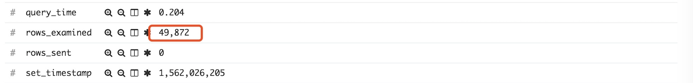

# Mysql索引之坑

注：部分数据做了处理

查看mysql慢日志



发现命中条数蛮多，于是找下是否是索引的问题

sql大意是根据店和菜谱id获取该菜谱下的所有菜

```sql
select * from t_mme where eid = ? and menu_id = ?
```

## 分析

1.查看表结构 `show create table t_mme;`

```sql
CREATE TABLE `t_mme` (
        `id` varchar(32) COLLATE utf8mb4_unicode_ci NOT NULL COMMENT '主键',
        `eid` varchar(8) COLLATE utf8mb4_unicode_ci NOT NULL COMMENT '实体id',
        `menu_id` varchar(32) COLLATE utf8mb4_unicode_ci NOT NULL COMMENT '菜单id',
        `item_id` varchar(32) COLLATE utf8mb4_unicode_ci NOT NULL COMMENT '菜id',
) ENGINE=InnoDB DEFAULT CHARSET=utf8mb4 COLLATE=utf8mb4_unicode_ci ROW_FORMAT=DYNAMIC COMMENT='菜单商品关联表';
```

2.也可以查看表上的索引 `show index from multiple_menu_element;`


看索引感觉没问题，难道是自己对索引的理解一直有问题。于是explain下
```sql
#根据菜谱id查
EXPLAIN select count(0) from t_mme  WHERE eid = 'xxx'  and menu_id = 'xxx';
#根据菜id查
EXPLAIN select  count(0) from t_mme  WHERE eid = 'xxx'  and item_id = 'xxx';
```


以上为第一条的执行结果，与预期的有出入

找dba查找原因：发现部分实例上执行是正确的，部分是有问题的，怀疑是索引的统计信息有问题。

## 结论

索引统计有误从而误导了mysql优化器的索引选择

## 解决方法

1.索引优化，利用`force index`语法强制使用某个索引，不要让mysql优化器去选择
```sql
EXPLAIN select count(menu_id) from t_mme  force index(idx_eid_menuId_itemId) WHERE eid = 'xxx'  and menuId = 'xxx' ;
```

2.索引统计信息重建
```sql
analyze table t_mme;
```

## 参考
* [show index from 及analyze table 详解](https://yq.aliyun.com/articles/502786)
* [mysql explain用法和结果的含义](https://www.cnblogs.com/yycc/p/7338894.html)
* [MYSQL 分析表、检查表和优化表](https://www.cnblogs.com/Alight/p/3906086.html)