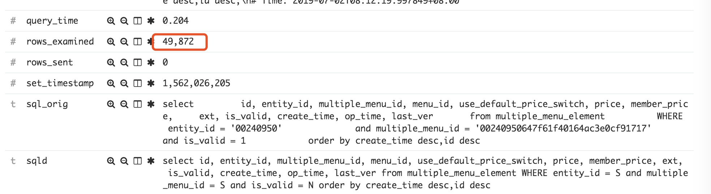
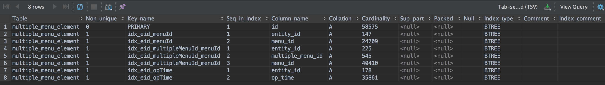
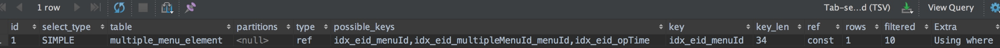

# Mysql索引之坑


查看mysql慢日志，发现命中条数蛮多，于是找下是否是索引的问题

## 分析

1. 查看表结构
`show create table multiple_menu_element;`

```sql
CREATE TABLE `multiple_menu_element` (
        `id` varchar(32) COLLATE utf8mb4_unicode_ci NOT NULL COMMENT '主键',
        `entity_id` varchar(8) COLLATE utf8mb4_unicode_ci NOT NULL COMMENT '实体id',
        `multiple_menu_id` varchar(32) COLLATE utf8mb4_unicode_ci NOT NULL COMMENT '多菜单主键',
        `menu_id` varchar(32) COLLATE utf8mb4_unicode_ci NOT NULL COMMENT '菜品主键',
        `use_default_price_switch` tinyint(4) NOT NULL COMMENT '是否使用默认价格:0.否 1.是',
        `price` decimal(18,2) NOT NULL COMMENT '价格',
        `member_price` decimal(18,2) NOT NULL COMMENT '会员价',
        `ext` varchar(5000) COLLATE utf8mb4_unicode_ci DEFAULT NULL COMMENT 'json格式扩展属性，目前只有规格价格，格式如下： {"specPrice":{"123":123,"345":123}',
        `is_valid` tinyint(4) NOT NULL COMMENT '是否有效:0.失效 1有效',
        `create_time` bigint(20) NOT NULL COMMENT '创建时间',
        `op_time` bigint(20) NOT NULL COMMENT '修改时间',
        `last_ver` int(11) NOT NULL COMMENT '版本号',
        PRIMARY KEY (`id`),
        KEY `idx_eid_menuId` (`entity_id`,`menu_id`),
        KEY `idx_eid_multipleMenuId_menuId` (`entity_id`,`multiple_menu_id`,`menu_id`),
        KEY `idx_eid_opTime` (`entity_id`,`op_time`)
) ENGINE=InnoDB DEFAULT CHARSET=utf8mb4 COLLATE=utf8mb4_unicode_ci ROW_FORMAT=DYNAMIC COMMENT='菜单商品关联表';
```

2.也可以查看表上的索引 `show index from multiple_menu_element;`


看索引感觉没问题，难道是自己对索引的理解一直有问题。于是explain下
```sql
#根据菜谱id查
EXPLAIN select count(0) from multiple_menu_element  WHERE entity_id = '00240950'  and multiple_menu_id = '00240950647f61f40164ac3e0cf91717';
#根据菜id查
EXPLAIN select  count(0) from multiple_menu_element  WHERE entity_id = '00240950'  and menu_id = '00240950647f61f40164ac3e0cf91717';
```


以上为第一条的执行结果，与预期的有出入

找dba查找原因：发现部分实例上执行是正确的，部分是有问题的，怀疑是索引的统计信息有问题。

## 结论

索引统计有误从而误导了mysql优化器的索引选择

## 解决方法

1.索引优化，利用`force index`语法强制使用某个索引，不要让mysql优化器去选择
```sql
EXPLAIN select count(multiple_menu_id) from multiple_menu_element  force index(idx_eid_multipleMenuId_menuId) WHERE entity_id = '00240950'  and multiple_menu_id = '00240950647f61f40164ac3e0cf91717' ;
```

2.索引统计信息重建
```sql
analyze table multiple_menu_element;
```

## 参考
* [show index from 及analyze table 详解](https://yq.aliyun.com/articles/502786)
* [mysql explain用法和结果的含义](https://www.cnblogs.com/yycc/p/7338894.html)
* [MYSQL 分析表、检查表和优化表](https://www.cnblogs.com/Alight/p/3906086.html)